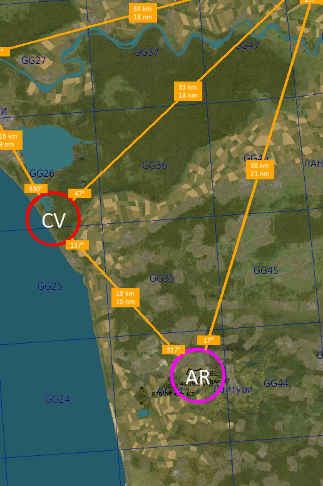

# DCS_KneeboardMaker

This tool allows generating kneeboard slides 
that can be used for navigation in Digital 
Combat Simulator (DCS) missions.

## Workflow description

First, you need an high resolution map of the region of interest.   
Such image can be made from in-game screenshots, 
or by scanning a vintage military map... 
It's up to the user.

Example (see file `example.png`, 1920 x 1080 pixels):

Then we open ("Ctrl+O") this image in the tool GUI and out some landmarks onto the map 
(left clicks),
add connections between some of the landmarks ("Ctrl+N"),
specify the image scale in kilometers per pixel ("Alt+S"),
and specify the output kneeboard slide positions and size (right clicks).

Don't forget to save ("Ctrl+S") the map configuration. 
All the info is then stored in [example_info.json](example_info.json).

Having done that, "Ctrl+E" will export the kneeboard slides to a set of JPG files 
(see [example_slides](example_slides)). 
Like this one:

One can play around with drawing settings by configuring
 [display_settings.py](display_settings.py).

More detailed description of how do do all will come later.

## Running the script

The GUI script can be run using your favourite Python3.7 interpreter: 

`>> path/to/your/python main_gui.py`

Required python packages are listed in `requirements.txt`.
All these are standard packages and can be easily 
installed using `pip`. 

An easy way to have Python with plenty installed libraries is to install
the latest [Anaconda](https://www.anaconda.com/distribution/).
 
Enjoy!

Me on DCS forums: https://forums.eagle.ru/member.php?u=124290
